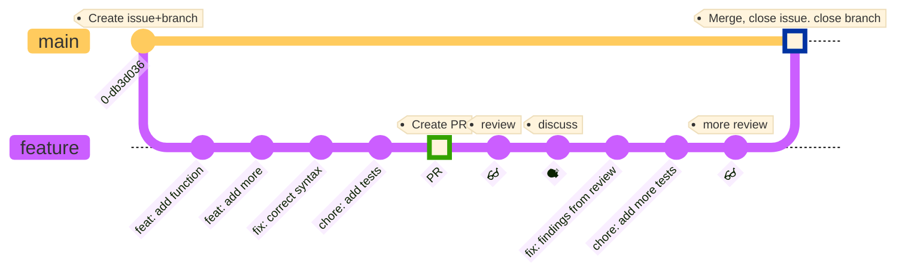

```mermaid

%%{init: { 'theme': 'base' } }%%
gitGraph
    commit tag: "Create issue+branch"
    branch feature
    checkout main
    checkout feature
    commit id: "feat: add function"
    commit id: "feat: add more"
    commit id: "fix: correct syntax"
    commit id: "chore: add tests"
    commit id: "PR" type: HIGHLIGHT tag: "Create PR"
    commit id: "👓 " tag: "review"
    commit id: "🗣️" tag: "discuss"
    checkout feature
    commit id: "fix: findings from review"
    commit id: "chore: add more tests"
    commit id: "👓" tag: "more review"
    checkout feature
    checkout main
    merge feature type: HIGHLIGHT tag: "Merge, close issue. close branch"

```